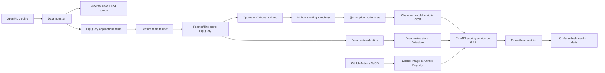

# Credit Risk MLOps Pipeline

An end-to-end credit-risk ML system built with an open-source MLOps stack on
Google Cloud. The project trains a default-risk model on the German Credit
dataset, tracks experiments, serves predictions with explanations, monitors the
API in Kubernetes, and ships changes through CI/CD.

The repository is intentionally production-shaped while staying small enough to
study: every major lifecycle stage is represented in code, config, tests, or
deployment manifests.

## End-to-End ML System Design

### System Goal

Score credit applications as `approve` or `reject` with a calibrated probability
of default, while keeping the training, serving, and monitoring paths aligned.

Dataset:

- **German Credit / Statlog** from OpenML (`credit-g`)
- **1,000 applications**
- **20 applicant and loan features**
- **Binary target:** `1 = bad/default`, `0 = good/non-default`

### Architecture



### Lifecycle Modules

| Stage | Module | Design role |
| --- | --- | --- |
| Data ingestion | `src/data/load_data.py` | Fetches OpenML data, normalizes the target, stores raw CSV in GCS, and loads BigQuery. |
| Feature table | `src/data/build_feature_table.py` | Adds `application_id` and `event_timestamp` so Feast can perform point-in-time joins. |
| Feature retrieval | `src/features/feast_loader.py` | Builds the training set through Feast, matching the online serving feature definitions. |
| Preprocessing | `src/features/preprocess.py` | Builds the scikit-learn `ColumnTransformer` used inside the model pipeline. |
| Training | `src/training/tune.py` | Runs Optuna search for XGBoost, logs trials to MLflow, registers the best model, and promotes the run's model version to `@champion`. |
| Explainability | `src/training/explain.py` | Generates global SHAP summary and importance reports for the champion model. |
| Serving | `src/serving/app.py` | Loads the champion model from GCS once at startup, serves `/predict`, `/predict/{id}`, `/explain`, `/health`, and `/metrics`. |
| Runtime | `k8s/serving.yaml` | Defines Deployment, Service, HPA, probes, rolling update policy, and Prometheus scraping. |
| Delivery | `.github/workflows/ci.yml` | Runs lint/tests on `main`, `version-1`, and `version-2`; deploy remains gated to `version-1`. |

### Data and Feature Contract

The same 20 feature names are used across training and serving:

- Categorical examples: `checking_status`, `credit_history`, `purpose`,
  `savings_status`, `employment`, `housing`
- Numeric examples: `duration`, `credit_amount`, `age`, `existing_credits`,
  `num_dependents`

Feast is the main contract between model development and live inference:

- Training reads historical features from BigQuery through
  `get_historical_features()`.
- Serving reads online features from Datastore through `get_online_features()`.
- `/predict/{application_id}` scores the same Feast-defined feature view used by
  training, reducing training/serving skew.

### Reliability and Resource Design

- **Startup loading:** the model, preprocessor, SHAP explainer, and Feast store
  are created once during FastAPI startup.
- **Readiness:** `/health` reports whether the model assets are loaded.
- **Rolling updates:** Kubernetes uses `maxUnavailable: 0` and `maxSurge: 1` so
  old pods stay available while new pods warm up.
- **Autoscaling:** HPA scales the serving deployment from 2 to 5 pods on CPU.
- **Resource bounds:** the serving container has explicit CPU and memory
  requests/limits.
- **Config:** project settings live in `config/config.yaml`, with documented
  environment overrides in `.env.example`.
- **Secrets:** no service-account keys are committed; GKE and GitHub Actions use
  Workload Identity / Workload Identity Federation.

### User Experience Impact

- `/predict` accepts a typed JSON credit application and returns:
  - `probability_default`
  - `decision`
- `/predict/{application_id}` supports low-friction scoring from online Feast
  features.
- `/explain` returns the top SHAP contributors for a single application, useful
  for model debugging and adverse-action-style review.
- `/docs` exposes FastAPI's interactive OpenAPI UI.
- Invalid payloads receive FastAPI/Pydantic validation errors instead of silent
  bad predictions.

## Tech Stack

| Concern | Tooling |
| --- | --- |
| Data lake | Google Cloud Storage |
| Analytics warehouse | BigQuery |
| Data versioning | DVC with GCS remote |
| Feature store | Feast: BigQuery offline, Datastore online |
| Model training | scikit-learn Pipeline + XGBoost |
| Hyperparameter tuning | Optuna |
| Experiment tracking | MLflow |
| Model registry | MLflow model registry with `@champion` alias |
| Explainability | SHAP |
| Serving | FastAPI + Uvicorn |
| Containerization | Docker + Artifact Registry |
| Runtime | GKE with Workload Identity and HPA |
| Observability | Prometheus, Grafana, Alertmanager rules |
| CI/CD | GitHub Actions with Workload Identity Federation |
| Load testing | `wrk` with Lua scripts |

## Repository Layout

```text
.
|-- config/config.yaml              # Project-wide config defaults
|-- feature_repo/                   # Feast feature definitions and store config
|-- src/
|   |-- config.py                   # Shared config, feature names, URI parsing
|   |-- data/                       # Ingestion and Feast table build
|   |-- features/                   # Preprocessing and Feast training loader
|   |-- training/                   # Training, tuning, and SHAP reporting
|   `-- serving/                    # FastAPI app
|-- k8s/                            # Deployment, Service, HPA, ServiceMonitor, alerts
|-- loadtest/                       # wrk scripts and saved reports
|-- mlflow-server/                  # MLflow tracking server image
|-- scripts/cloud_shell_permissions.sh
|-- tests/                          # Unit tests for local CI
|-- Dockerfile                      # Serving image
|-- Makefile                        # Common development tasks
|-- requirements.txt                # Full training/development dependencies
`-- requirements-serve.txt          # Slim serving image dependencies
```

## Available Reports

The repo includes saved load-test and autoscaling evidence under
`loadtest/reports/`.

| Report | What it shows |
| --- | --- |
| `wrk_20260618-103500.txt` | 2-minute `wrk` run against the API with 8 threads and 100 connections: **103.96 req/s**, p50 **715 ms**, p90 **1.46 s**, p99 **1.91 s**, with timeout pressure under load. |
| `wrk_post_20260618-104031.txt` | Follow-up run after scaling: **111.38 req/s**, p50 **593 ms**, p90 **1.52 s**, p99 **1.94 s**. |
| `scale_before_20260618-103500.txt` | HPA snapshot showing CPU at **123% / 60% target** and 5 serving replicas active. |
| `scale_after_20260618-103500.txt` | HPA snapshot showing sustained pressure at **221% / 60% target** with 5 replicas active. |

The training code also produces MLflow artifacts:

- Trial metrics and parameters from Optuna
- Test AUC and KS for the selected model
- Registered model versions for `credit-risk-model`
- SHAP summary plot: `shap_summary.png`
- SHAP importance bar plot: `shap_importance_bar.png`

## Quickstart

Prerequisites:

- GCP project with billing enabled
- `gcloud`, `kubectl`, Docker, and Python 3.12
- Owner-level setup run from Cloud Shell
- Development/training run from a GCP environment with access to BigQuery, GCS,
  Datastore, and MLflow

Install dependencies:

```bash
python3 -m venv .venv
source .venv/bin/activate
pip install -r requirements.txt
```

Run local checks:

```bash
make lint
make test
```

Run the ML lifecycle:

```bash
# 1. One-time cloud permissions from Cloud Shell
bash scripts/cloud_shell_permissions.sh

# 2. Load raw data and build Feast-ready table
make ingest
make features

# 3. Register Feast definitions and materialize online features
make feast-apply
make feast-materialize

# 4. Train, register, and explain the champion model
make train
make explain

# 5. Build and deploy serving
PROJECT_ID=credit-risk-mlops-0812 make build
make deploy
```

Call the deployed API:

```bash
IP=$(kubectl get svc credit-serving -n credit -o jsonpath='{.status.loadBalancer.ingress[0].ip}')
curl -s "http://$IP/predict/42"
```

## API Surface

```text
GET  /health
GET  /metrics
POST /predict
GET  /predict/{application_id}
POST /explain
GET  /docs
```

Example `/predict` payload:

```json
{
  "checking_status": "<0",
  "duration": 12,
  "credit_history": "critical/other existing credit",
  "purpose": "radio/tv",
  "credit_amount": 1169,
  "savings_status": "no known savings",
  "employment": ">=7",
  "installment_commitment": 4,
  "personal_status": "male single",
  "other_parties": "none",
  "residence_since": 4,
  "property_magnitude": "real estate",
  "age": 67,
  "other_payment_plans": "none",
  "housing": "own",
  "existing_credits": 2,
  "job": "skilled",
  "num_dependents": 1,
  "own_telephone": "yes",
  "foreign_worker": "yes"
}
```

Example response:

```json
{
  "probability_default": 0.1842,
  "decision": "approve"
}
```

## Configuration

Primary config lives in `config/config.yaml`. Environment variables can override
the deploy-specific settings:

| Environment variable | Config key |
| --- | --- |
| `PROJECT_ID` | `project_id` |
| `REGION` | `region` |
| `BUCKET` | `bucket` |
| `BQ_DATASET` | `bq_dataset` |
| `BQ_TABLE` | `bq_table` |
| `RAW_DATA_PATH` | `raw_data_path` |
| `TARGET_COLUMN` | `target_column` |
| `MLFLOW_TRACKING_URI` | `mlflow_tracking_uri` |
| `MLFLOW_EXPERIMENT` | `mlflow_experiment` |
| `MODEL_NAME` | `model_name` |

Serving-specific variables:

| Environment variable | Purpose |
| --- | --- |
| `MODEL_GCS_URI` | GCS URI for the exported champion `model.joblib` |
| `FEAST_REPO` | Path to the Feast repository inside the serving image |
| `DECISION_THRESHOLD` | Probability cutoff for `reject` vs `approve` |
| `XGBOOST_N_JOBS` | Default XGBoost worker count for tuning |
| `CV_N_JOBS` | Default cross-validation worker count for tuning |

## Engineering Notes

- **Architecture:** modules follow the ML lifecycle, with Feast acting as the
  training/serving feature contract and MLflow acting as the model registry.
- **Readability:** shared config and feature names live in `src/config.py`
  instead of being duplicated across scripts.
- **Performance:** model assets are initialized once at startup; tuning avoids
  nested all-core parallelism by default.
- **Memory efficiency:** the serving image installs only serving dependencies;
  temporary model/report files are cleaned up after loading/logging.
- **Reliability:** config validation, GCS URI validation, readiness checks,
  rolling updates, and CI tests catch common failure modes early.
- **Resource management:** Kubernetes requests/limits and HPA settings are
  checked into version control; expensive training parallelism is explicit.
- **Maintainability:** tests cover preprocessing and configuration seams; Make
  targets document common workflows.

## Cost Management

GKE is the largest recurring cost. To pause the environment:

```bash
gcloud container clusters resize credit-mlops-cluster \
  --node-pool default-pool \
  --num-nodes 0 \
  --zone us-central1-a \
  --quiet

gcloud sql instances patch mlflow-db --activation-policy=NEVER
gcloud workbench instances stop credit-risk-workbench --location=us-central1-a
```

To resume, resize the node pool back to 2 nodes, set Cloud SQL activation policy
to `ALWAYS`, and start the Workbench instance.

## Security Notes

This is a learning project. Public LoadBalancers and public MLflow/Grafana-style
interfaces are convenient for demos, but they are not production-safe defaults.

Before using real customer data:

- Put public services behind authenticated ingress or IAP.
- Add API authentication and authorization.
- Restrict MLflow and Grafana access.
- Store secrets in Secret Manager.
- Add drift and performance monitoring for post-deployment model health.

## Roadmap

- [x] Data ingestion, BigQuery loading, and DVC pointer
- [x] Feast offline/online feature store
- [x] Optuna + XGBoost training with MLflow tracking
- [x] SHAP explainability reports
- [x] FastAPI serving container
- [x] GKE deployment with HPA and Prometheus metrics
- [x] GitHub Actions lint/test/build/deploy
- [ ] Drift monitoring: PSI, KS, chi-square, and performance labels
- [ ] Scheduled retraining and model promotion workflow
- [ ] Authenticated ingress for API, MLflow, and dashboards
